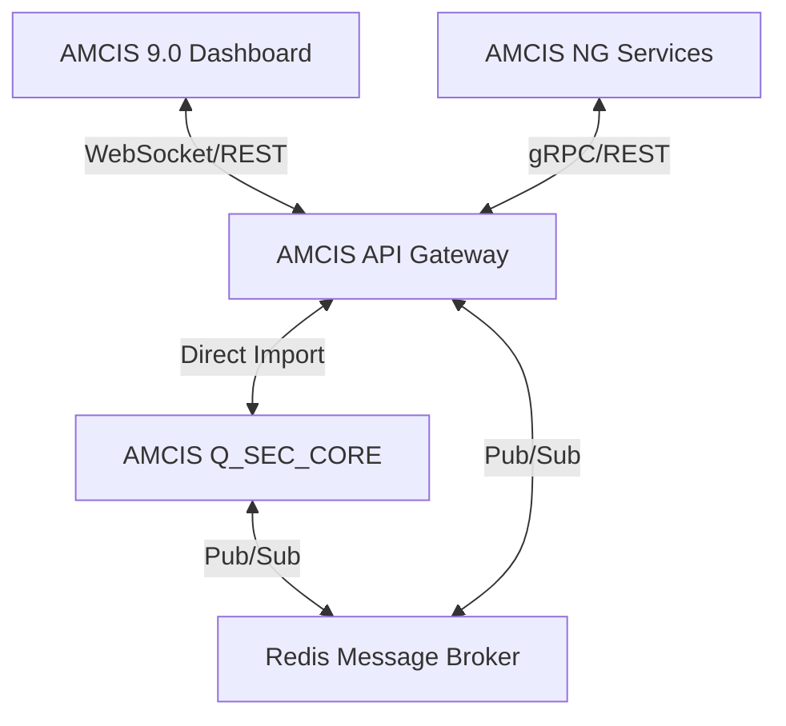

# 🌉 AMCIS INTEGRATION ARCHITECTURE (G1)

**Version:** 1.0.0  
**Status:** DRAFT  
**Goal:** Formalize the communication between AMCIS 9.0 (NG/Frontend) and Q_SEC_CORE (Security Backend).

---

## 🏗️ 1. ARCHITECTURAL OVERVIEW
The system uses a **Broker-Based Bridge** architecture. The `amcis_server.py` (FastAPI) acts as the primary API Gateway, proxying requests to the local Python modules and streaming real-time events via WebSockets.



---

## 🔌 2. API CONTRACT (REST)
All endpoints reside under `/api/v1/`.

| Endpoint | Method | Description | Source Module |
|----------|--------|-------------|---------------|
| `/threats` | GET | List active/investigated threats | `anomaly_engine` |
| `/threats/{id}/mitigate` | POST | Trigger automated response | `response_engine` |
| `/keys/status` | GET | Post-Quantum key health/rotation | `crypto.amcis_key_manager` |
| `/compliance/score` | GET | Real-time NIST CSF 2.0 readiness | `compliance.nist_csf` |
| `/trust/score/{id}` | GET | Zero-Trust score for a specific node | `trust_engine` |

---

## 📡 3. REAL-TIME TELEMETRY (WEBSOCKETS)
A single WebSocket endpoint `/ws/stream` provides multiplexed data streams.

### Stream Topics:
1. **`security_events`**: Live alerts from the Anomaly Engine.
2. **`system_health`**: Resource usage (CPU, RAM, Disk) from the Kernel.
3. **`pqc_logs`**: Cryptographic activity and handshake status.
4. **`compliance_updates`**: Changes in compliance score during automated audits.

---

## 📦 4. SHARED DATA MODELS
Data is exchanged as JSON following these schemas:

### Security Alert
```json
{
  "event_id": "uuid",
  "severity": "CRITICAL",
  "source": "amcis-kernel",
  "description": "Unauthorized access attempt detected",
  "timestamp": "iso-date",
  "metadata": { "ip": "1.2.3.4", "module": "EDR" }
}
```

---

## 🛠️ 5. SECURITY & AUTH
- **Inter-service**: Shared Secret / API Key in `X-AMCIS-KEY` header.
- **Frontend**: JWT obtained via OAuth2/FIDO2 flow (managed by NG services).
- **Encryption**: All bridge traffic is wrapped in Hybrid PQC TLS (where supported).

---

## 📝 HANDOFF NOTES FOR KIMI
1. Use `FastAPI`'s `WebSocket` support in `amcis_server.py`.
2. Implement a `RedisManager` class to handle Pub/Sub for cross-process communication.
3. Ensure all `Q_SEC_CORE` modules use the `amcis_kernel.logger` for event emission.
